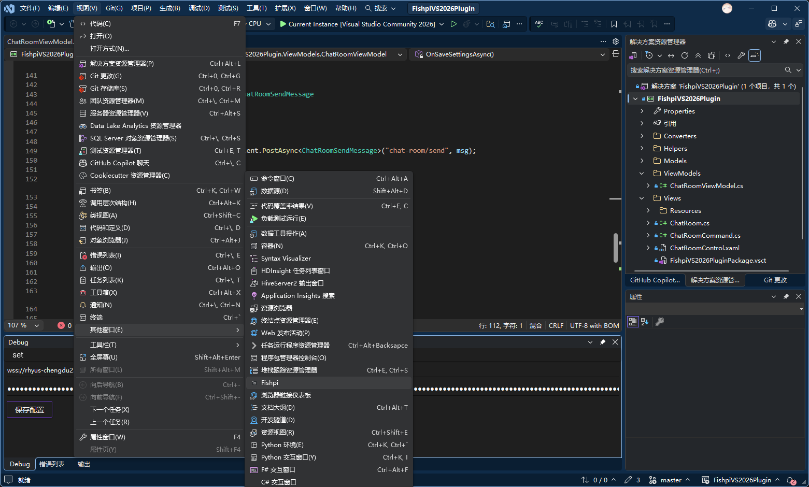

# 摸鱼派聊天室VS拓展

一个将摸鱼派聊天室集成到 Visual Studio 的扩展。

**项目主页与下载**

- Releases: [https://github.com/probieLuo/FishpiVS2026Plugin/releases](https://github.com/probieLuo/FishpiVS2026Plugin/releases)

**安装**

1. 访问 Releases 页面下载最新的 `.vsix` 文件。
2. 安装前请先关闭 Visual Studio。
3. 双击 `FishpiVS2026Plugin.vsix` 进行安装。

**配置**

1. 登录摸鱼派网页版（[https://fishpi.cn](https://fishpi.cn)）。
2. 打开地址： [https://fishpi.cn/chat-room/node/get](https://fishpi.cn/chat-room/node/get) ，获取 `node` 与 `apikey`。
3. 在 Visual Studio 中打开扩展窗口：视图 => 其他窗口 => Fishpi。
4. 在扩展窗口中点击 `set`，填写 `node` 和 `apikey` 并保存。

**后续更新**

- [ ] 聊天室消息引用回复，目前还没搞懂是怎么引用的，貌似是在content或者md里面？
- [ ] markdown支持，大工程！因为目前wpf没有很好的支持markdown的包，有一个Markdig新出的，不过还没用过

---
谢谢使用！