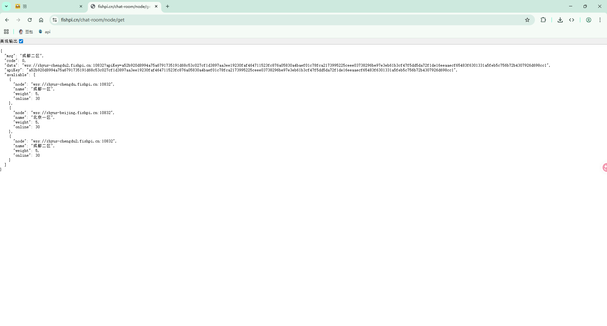
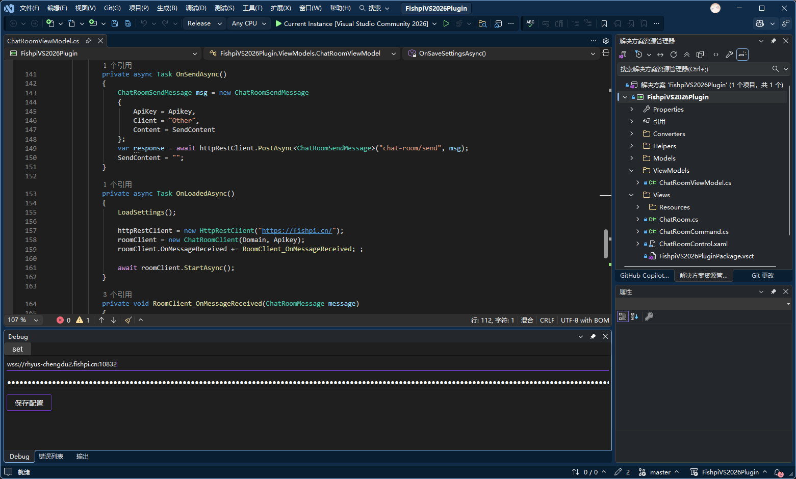
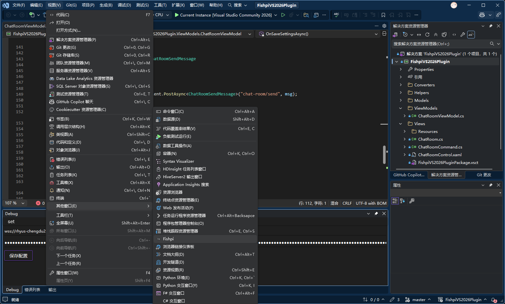
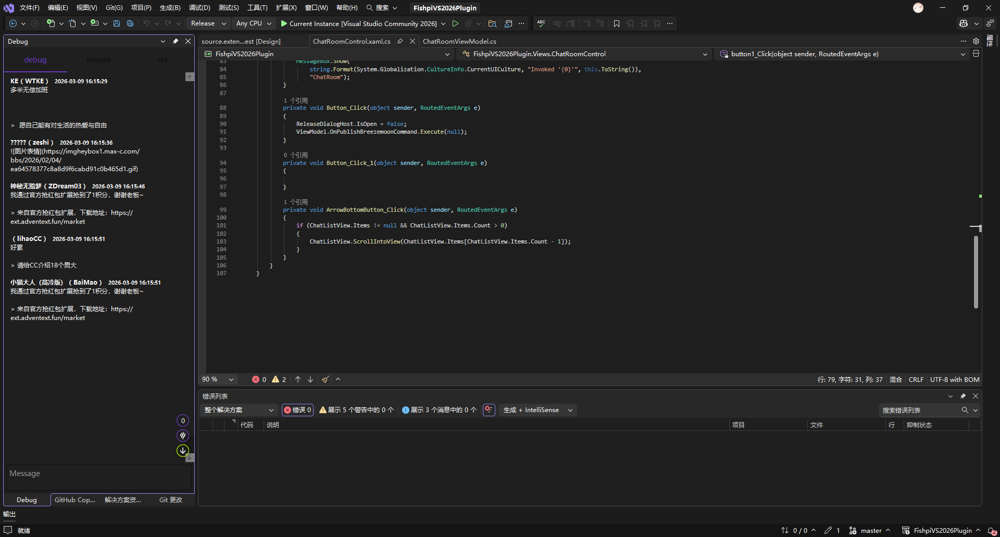

# 摸鱼派聊天室 `Visual Studio` 扩展

这是一个将摸鱼派聊天室集成到 Visual Studio 的扩展，在打代码的同时无缝摸鱼，目前只试过VS2026，不过2022应该也是可以的，其他的就不知道了。

~后续可能会更新，完善了会打包到拓展市场。~ 市场已发布 [鱼排聊天室VisualStudio拓展](https://marketplace.visualstudio.com/items?itemName=fishpi-csharp.fishpivs3a86116a59f44c3ea71adc161012381e2e)

**项目主页与下载**

- Releases: [https://github.com/probieLuo/FishpiVS2026Plugin/releases](https://github.com/probieLuo/FishpiVS2026Plugin/releases)

**安装**

1. 访问 Releases 页面下载最新的 `.vsix` 文件。
2. 安装前请先关闭 Visual Studio。
3. 执行 `FishpiVS2026Plugin.vsix` 进行安装。

**配置**

1. 登录摸鱼派网页版（[https://fishpi.cn](https://fishpi.cn)）。
2. 打开地址： [https://fishpi.cn/chat-room/node/get](https://fishpi.cn/chat-room/node/get) ，获取 `node` 与 `apikey`。
3. 在 Visual Studio 中打开扩展窗口：视图 => 其他窗口 => Fishpi。
4. 在扩展窗口中点击 `set`，填写 `node` 和 `apikey` 并保存。

谢谢使用！

---

**Todo**

- [x] 消息引用
- [x] 撤回消息
- [x] 领取活跃奖励
- [x] 查看活跃度
- [x] 清风明月
- [x] 聊天室小尾巴
- [x] 屏蔽机器人消息
- [x] 屏蔽空消息
- [ ] 收发红包
- [ ] 其他摸鱼小功能...

效果展示~

